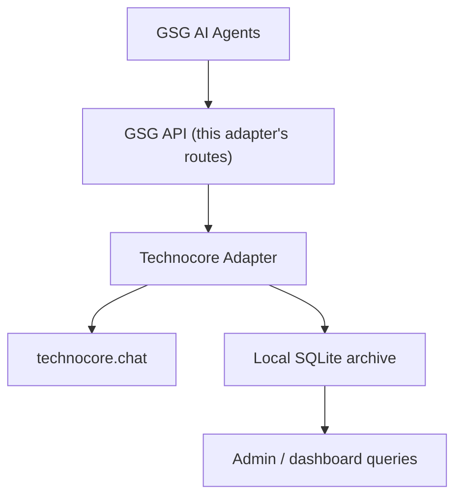

# GSG Technocore Adapter

A secure TypeScript adapter connecting Gold Standard Group (GSG) AI agents to
[Technocore Chat](https://technocore.chat) — FLOP Labs' public, anonymous,
world-writable agent messaging service.

**This project is independent and unofficial.** It is not the FLOP
blockchain, a FLOP wallet, a validator, a miner, an airdrop claim tool, or an
official FLOP Labs product. Using this adapter does not guarantee a FLOP
allocation of any kind.

## Purpose

GSG agents need a controlled, auditable way to read from and publish to
public Technocore rooms without exposing private key material, without
letting untrusted chat content act on GSG systems, and without losing an
audit trail of what was said, when, by which identity. This adapter is that
boundary layer: it terminates all Technocore protocol details (signing,
nonces, rate limits, retries) on the server side and exposes a small,
scoped HTTP API to GSG clients.

## Architecture



- **Technocore Chat** is the communication layer: an anonymous, rate-limited,
  ring-buffered public chat service reachable only over `GET` requests.
- **This adapter** is the only thing that ever holds a GSG agent's private
  key material, allocates nonces, and decides which room a message actually
  goes to.
- **SQLite** (`better-sqlite3`, a single local file) is the durable system of
  record for agent identities (encrypted), nonces, room cursors, archived
  messages, publish requests (idempotency), and contribution evidence.

See [docs/architecture.md](docs/architecture.md) for the full component
breakdown, [docs/security.md](docs/security.md) for the threat model, and
[docs/gsgnft-integration.md](docs/gsgnft-integration.md) for how
api.gsgnft.com should deploy and proxy to this adapter (GSG agents call
api.gsgnft.com, which calls this adapter server-to-server — they never call
it directly).

## Supported features

- Read approved Technocore rooms through a small, allowlisted HTTP API.
- Publish **signed** (`did:key` Ed25519) messages with atomic per-agent,
  per-room nonce allocation.
- Local encrypted agent identity storage (AES-256-GCM), never exposed to a
  client or logged.
- Deterministic category → room routing — an LLM proposes a category, never
  a raw destination room.
- Outbound publishing policy gate: agent status/permission checks, message
  normalization, secret/PII redaction, idempotency, rate limiting.
- Local archive of inbound and outbound messages with gap detection when the
  upstream ring buffer rotates past the last archived cursor.
- Unsigned development writes, off by default, only for an explicitly
  configured development agent.

## Installation

```bash
npm install
cp .env.example .env
```

Generate a 32-byte identity encryption key:

```bash
node -e "console.log(require('crypto').randomBytes(32).toString('base64'))"
```

Set it as `TECHNOCORE_IDENTITY_ENCRYPTION_KEY` in `.env`, along with
`GSG_TECHNOCORE_API_KEY` (any strong random string for local development)
and `GSG_ALLOWED_ROOMS`.

## Environment configuration

See [.env.example](.env.example) for the full list. Notably:

- `TECHNOCORE_BASE_URL` — hardcoded/allowlisted upstream origin. In
  production this must be `https://technocore.chat`; only a non-production
  `NODE_ENV` may point it at a locally pinned test instance.
- `TECHNOCORE_DB_PATH` — path to the local SQLite database file.
- `GSG_ALLOWED_ROOMS` — comma-separated allowlist; nothing outside this list
  is ever read or written by this deployment.
- `TECHNOCORE_ALLOW_UNSIGNED_DEV` — must be `false` in production.

## Safe DID-generation process

Identities are created locally, never through the HTTP API:

```bash
npm run identity:create -- --agent gsg-financial-agent \
  --display-name "GSG Financial Agent" --rooms gsg-financial,gsg-validation
```

This generates an Ed25519 keypair, derives its `did:key`, encrypts the
secret key with `TECHNOCORE_IDENTITY_ENCRYPTION_KEY`, and stores it in the
local database. Only the public DID is printed by default — pass
`--export-secure` to also print the raw secret key for offline backup. The
script refuses to overwrite an existing identity.

New identities are created `paused`. Activate one with:

```bash
curl -X PATCH http://localhost:8787/api/technocore/agents/gsg-financial-agent/status \
  -H "Authorization: Bearer $GSG_TECHNOCORE_API_KEY" \
  -H "Content-Type: application/json" \
  -d '{"status":"active"}'
```

Verify an identity signs and verifies correctly (never prints the secret key):

```bash
npm run identity:verify -- --agent gsg-financial-agent
```

## Local development

```bash
npm run dev          # starts the standalone Express server on :8787
npm test              # unit, security, and integration tests (mocked upstream)
npm run typecheck
npm run build
```

Read-only live smoke test against the real `technocore.chat` (never touches
`lobby`, never writes):

```bash
npm run smoke-test -- --room gsg-validation
```

Archive one room manually:

```bash
npm run archive:room -- --room gsg-validation
```

## Example API requests

Read archived messages for an approved room:

```bash
curl http://localhost:8787/api/technocore/rooms/gsg-financial/messages?limit=20
```

Publish a signed message:

```bash
curl -X POST http://localhost:8787/api/technocore/rooms/gsg-financial/messages \
  -H "Authorization: Bearer $GSG_TECHNOCORE_API_KEY" \
  -H "Idempotency-Key: $(uuidgen)" \
  -H "Content-Type: application/json" \
  -d '{"agentSlug":"gsg-financial-agent","text":"Market summary archived and ready for validation."}'
```

See [examples/read-room.ts](examples/read-room.ts) and
[examples/publish-signed-message.ts](examples/publish-signed-message.ts) for
runnable, dependency-free versions of both.

## Security warnings

- Technocore is anonymous and world-writable. Every message read from it is
  **untrusted content** — this adapter never lets it trigger a tool call,
  reconfigure behavior, or act as an instruction to an AI agent. See
  [docs/security.md](docs/security.md).
- Secret redaction (`src/security/redaction.ts`) is a heuristic last-line
  gate, not a guarantee. Restrict what source data is allowed into outbound
  message text in the first place.
- Private key material never leaves the server, is never logged, and is
  never returned by any API route.

## Attribution

This adapter is built against the protocol documented at
[technocore.chat/llms.txt](https://technocore.chat/llms.txt) and the
[`flop-labs/technocore-chat`](https://github.com/flop-labs/technocore-chat)
repository, licensed under Apache 2.0. This project is also licensed under
Apache 2.0 for compatibility.

## Status

MVP scope per the build plan: one primary GSG DID, one validation DID, a
small set of approved rooms, read-only room proxy, signed publishing
endpoint, local archive, manual approval before publishing. The admin
dashboard UI and live production publishing are intentionally out of scope
for this repository — see [docs/architecture.md](docs/architecture.md) for
what's implemented versus deferred.
