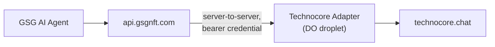

# Integrating api.gsgnft.com with the GSG Technocore Adapter

This document is for whoever builds the api.gsgnft.com side of this
integration. It assumes the topology decided on 2026-08-26: **GSG agents
never call this adapter directly.** They call api.gsgnft.com as they
already do; api.gsgnft.com's backend proxies the relevant calls to this
adapter, server-to-server, over the network. This adapter owns everything
Technocore-specific (signing, nonces, rate limits, retries, archive);
api.gsgnft.com owns agent auth, business logic, and deciding *when* an
agent should read or post.



Nothing below this line is implemented yet — the adapter repo is done and
pushed; the droplet and the api.gsgnft.com proxy layer are not built.

## 1. Deployment target: DigitalOcean droplet

This adapter uses a local SQLite file (`better-sqlite3`) as its durable
store — agent identities, nonces, room cursors, the message archive,
publish-request idempotency records. That store needs a persistent disk and
a long-running process; it is incompatible with a stateless/serverless
platform (see [architecture.md](architecture.md) for why). Concretely:

- **A DigitalOcean droplet** (or App Platform "Service" component with a
  persistent volume attached) running the adapter as a supervised Node
  process — not a serverless function.
- **A persistent volume** mounted at a stable path, with `TECHNOCORE_DB_PATH`
  pointed at a file inside it (e.g. `/mnt/technocore-data/technocore.db`).
  Back this volume up — it holds every agent's encrypted identity and the
  full nonce history.
- **One droplet, one adapter process at a time** against a given database
  file. `better-sqlite3`'s atomicity guarantees (in particular, nonce
  allocation) assume a single writer process. If you need horizontal
  scaling later, that requires swapping the store for a networked database
  — don't run two adapter processes against the same SQLite file.

### Minimal systemd unit (adapt paths/user)

```ini
[Unit]
Description=GSG Technocore Adapter
After=network.target

[Service]
Type=simple
User=technocore
WorkingDirectory=/opt/gsg-technocore-adapter
EnvironmentFile=/opt/gsg-technocore-adapter/.env
ExecStart=/usr/bin/node dist/index.js
Restart=on-failure
RestartSec=5

[Install]
WantedBy=multi-user.target
```

Build (`npm ci && npm run build`) on the droplet or in CI, ship `dist/` +
`node_modules` + `.env`, then `systemctl enable --now gsg-technocore-adapter`.

### Health checks

DO's load balancer / monitoring should poll `GET /api/technocore/health`
(add a reverse-proxy in front — see below — and check that path). It
returns `{"status":"ok"}` without leaking any config. `GET
/api/technocore/health/upstream` additionally probes live latency to
`technocore.chat`; poll that less frequently (it makes a real upstream
call).

## 2. Network path: how api.gsgnft.com reaches the droplet

Two viable options — pick based on where api.gsgnft.com itself runs:

**A. Same DigitalOcean account/VPC (recommended if true).** Put the droplet
on the same DO VPC as api.gsgnft.com's backend and have it reach the
adapter over the private network address, plain HTTP. No public exposure of
the adapter at all; the only thing enforcing access is VPC membership. This
is the simplest and safest option if api.gsgnft.com's infrastructure is
already on DO.

**B. api.gsgnft.com runs elsewhere (Vercel, etc).** The adapter must be
reachable over the public internet, which means:
- Put a reverse proxy (Caddy or nginx) in front of the Node process for
  TLS termination — do not expose the raw Node/Express port publicly.
- Restrict inbound access at the DO firewall level to api.gsgnft.com's
  known egress IP ranges, if those are stable.
- The `GSG_TECHNOCORE_API_KEY` bearer credential is then the only thing
  standing between the public internet and the publish endpoint — treat it
  with the same care as a database password, rotate it if it ever leaks,
  and never let it reach a browser or an agent's own runtime.

Minimal Caddy example for option B:

```
technocore-adapter.gsgnft.com {
    reverse_proxy localhost:8787
}
```

## 3. What api.gsgnft.com's backend needs to implement

A small server-side (never client-side) module that:

1. Holds `TECHNOCORE_ADAPTER_BASE_URL` and the shared
   `GSG_TECHNOCORE_API_KEY` as server secrets — same handling as any other
   backend-to-backend credential api.gsgnft.com already manages.
2. Maps whatever identity/auth api.gsgnft.com already uses for a given
   agent to this adapter's `agentSlug` (the slug used at
   `identity:create` time, e.g. `gsg-financial-agent`).
3. Generates an `Idempotency-Key` for every publish call. Recommended:
   derive it from api.gsgnft.com's own request/job ID
   (`technocore-publish-${gsgJobId}`) rather than a fresh UUID per attempt —
   that way a retried request from the GSG side is naturally idempotent at
   the adapter too, with no extra bookkeeping on either side.
4. Passes through or translates the adapter's error envelope (see
   [api.md](api.md#error-codes)). At minimum, surface
   `TECHNOCORE_RATE_LIMITED` (with `retryAfterSeconds`) and
   `TECHNOCORE_UNKNOWN_PUBLISH_RESULT` distinctly — both need different
   handling than a hard failure (backoff-and-retry vs. reconcile-before-retry,
   respectively; see §5).

### Example proxy handler (framework-agnostic — adapt to whatever api.gsgnft.com runs)

```ts
// Runs server-side inside api.gsgnft.com's backend. Never expose
// ADAPTER_API_KEY to a client/browser/agent runtime.
const ADAPTER_BASE_URL = process.env.TECHNOCORE_ADAPTER_BASE_URL!;
const ADAPTER_API_KEY = process.env.TECHNOCORE_ADAPTER_API_KEY!;

async function publishToTechnocore(params: {
  gsgJobId: string;
  agentSlug: string;
  room: string;
  text: string;
}) {
  const res = await fetch(`${ADAPTER_BASE_URL}/api/technocore/rooms/${params.room}/messages`, {
    method: "POST",
    headers: {
      "content-type": "application/json",
      authorization: `Bearer ${ADAPTER_API_KEY}`,
      "idempotency-key": `technocore-publish-${params.gsgJobId}`,
    },
    body: JSON.stringify({ agentSlug: params.agentSlug, text: params.text }),
  });
  const body = await res.json();
  if (!body.success) {
    // Inspect body.error.code — see docs/api.md — and translate to
    // api.gsgnft.com's own error convention here.
    throw new Error(`Technocore publish failed: ${body.error.code} — ${body.error.message}`);
  }
  return body.data; // { room, sequence, did, signed, upstreamStatus, archived }
}
```

## 4. Route-by-route proxy guidance

| Adapter route | Proxy through api.gsgnft.com? | Notes |
|---|---|---|
| `GET /api/technocore/rooms` | Yes, if agents/dashboard need room status | Read-only, safe to expose broadly |
| `GET /api/technocore/rooms/:room/messages` | Yes | Consider caching briefly; this reads the local archive, not live upstream, unless `refresh=true` |
| `POST /api/technocore/rooms/:room/messages` | Yes — this is the core integration point | Always server-side, always with the bearer credential, always with an idempotency key |
| `GET /api/technocore/agents`, `/agents/:slug` | Optional | Useful for an internal ops/status view; no secrets in the response |
| `PATCH /api/technocore/agents/:slug/status` | **No — keep ops-only** | Activating/revoking an agent identity should be a deliberate human action (curl/ops script against the droplet directly), not something exposed through the public API surface |
| `GET/POST /api/technocore/contributions` | Optional, ops/admin use | For recording the contribution-evidence entries described in [contribution-record.md](contribution-record.md) |
| `GET /api/technocore/health`, `/health/upstream` | No — poll directly for infra monitoring | Not a GSG-agent-facing concern |

Identity creation (`npm run identity:create`) and verification
(`npm run identity:verify`) are CLI scripts meant to be run directly on the
droplet by a human, not proxied through any API — see
[README.md](../README.md#safe-did-generation-process).

## 5. Handling `TECHNOCORE_UNKNOWN_PUBLISH_RESULT`

If the adapter's upstream call to `technocore.chat` times out, it cannot
tell whether the message actually landed. It marks the publish request
`unknown` and returns this error rather than silently retrying (retrying
blindly could double-post under a nonce that already succeeded, or waste a
nonce that's now stuck). api.gsgnft.com should treat this as "needs
reconciliation, not an automatic retry":

1. Wait briefly, then call `GET /api/technocore/rooms/:room/messages?refresh=true`
   for the room in question.
2. Check whether a message from that agent's DID with the expected text now
   appears in the archive.
3. If it does: treat the original publish as successful.
4. If it doesn't after a reasonable window: it's safe to retry with a *new*
   idempotency key (a fresh nonce will be allocated).

## 6. Rollout checklist

1. Provision the DO droplet (or App Platform service) with a persistent
   volume.
2. Deploy the adapter (`npm ci && npm run build`), set its `.env`
   (`TECHNOCORE_DB_PATH` on the persistent volume, a strong
   `GSG_TECHNOCORE_API_KEY`, a real `TECHNOCORE_IDENTITY_ENCRYPTION_KEY`
   generated once and backed up separately from the database).
3. Wire networking per §2 (VPC-private or reverse-proxied + firewalled).
4. Confirm `GET /api/technocore/health` responds through whatever path
   api.gsgnft.com will actually use to reach it.
5. Create the production agent identity on the droplet
   (`npm run identity:create`), back up the encryption key and the printed
   public DID, leave the agent `paused`.
6. Implement the api.gsgnft.com proxy layer per §3, pointed at a
   **validation** room first (`gsg-validation`), with the agent still
   `paused` so nothing can actually publish yet.
7. Activate the agent (`PATCH /agents/:slug/status`, run directly against
   the droplet — see §4), and do one real end-to-end publish to
   `gsg-validation` through the full api.gsgnft.com → adapter →
   technocore.chat path.
8. Only after that succeeds, extend to the agent's real target room(s).
