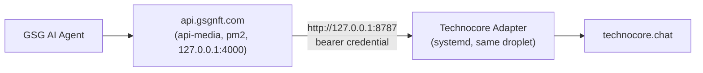

# Integrating api.gsgnft.com with the GSG Technocore Adapter

This document is for whoever builds the api.gsgnft.com side of this
integration. It assumes the topology decided on 2026-08-26: **GSG agents
never call this adapter directly.** They call api.gsgnft.com as they
already do; api.gsgnft.com's backend proxies the relevant calls to this
adapter, server-to-server, over loopback on the same droplet. This adapter owns everything
Technocore-specific (signing, nonces, rate limits, retries, archive);
api.gsgnft.com owns agent auth, business logic, and deciding *when* an
agent should read or post.



**Decided 2026-10-02:** the adapter runs as a **separate systemd service on
the same DigitalOcean droplet as api-media**, not inside api-media's process.
api-media uses Express 5 and zod 4, and this adapter's router is built on
Express 4 and zod 3, so mounting it in-process is ruled out. The
step-by-step install, including migrating the existing identity, is in
[deployment-runbook.md](deployment-runbook.md).

## 1. Deployment target: the api.gsgnft.com droplet

This adapter uses a local SQLite file (`better-sqlite3`) as its durable
store. That file holds agent identities, nonces, room cursors, the message
archive and publish-request idempotency records. It needs a persistent
disk and a long-running process, which the droplet provides:

- **Service:** `gsg-technocore-adapter.service`
  ([deploy/systemd/](../deploy/systemd/)). It runs `node dist/index.js` as
  a dedicated, unprivileged `technocore` user, kept separate from the pm2
  fleet, which runs as root. The unit pins `HOST=127.0.0.1` and applies a
  hardening baseline: `NoNewPrivileges`, `ProtectSystem=strict`, and
  `ReadWritePaths` limited to the database directory.
- **Database:** `/var/lib/gsg-technocore-adapter/technocore.db`
  (`TECHNOCORE_DB_PATH`). Back it up: it holds every agent's encrypted
  identity and the full nonce history.
- **Archiving:** `gsg-technocore-archive.timer` runs
  `scripts/archive-all.ts` every 5 minutes over every room in
  `GSG_ALLOWED_ROOMS`. Archiving does not depend on anyone calling
  `?refresh=true`.
- **One long-running adapter process per database file.** Nonce allocation
  is atomic in SQLite, and the short-lived archive job can safely share the
  file (`better-sqlite3` waits up to 5 s on a lock). But don't run two
  copies of the service, or the same identity from two databases. See the
  runbook, step 6.

### Health checks

`GET http://127.0.0.1:8787/api/technocore/health` returns
`{"status":"ok", …}` without leaking any config. Poll it from the droplet
itself. `GET /api/technocore/health/upstream` also measures live latency
to `technocore.chat`, so poll it less often: it makes a real upstream call.

## 2. Network path: api-media → 127.0.0.1:8787

api-media reaches the adapter over loopback on the same host:

```
TECHNOCORE_ADAPTER_BASE_URL=http://127.0.0.1:8787
```

- **No TLS and no public exposure.** Traffic never leaves the machine.
  nginx on 80/443 does **not** proxy `/api/technocore/*` to the adapter.
  Agents and browsers reach Technocore functionality only through
  api-media's own routes.
- **The adapter binds `127.0.0.1` by default** (`HOST`, see
  [.env.example](../.env.example)), and the systemd unit pins it. This
  matters on this droplet: it has no host firewall (ufw is inactive, and the
  iptables INPUT policy is ACCEPT). Anything listening on `0.0.0.0` would be
  reachable from the internet, including the adapter's unauthenticated read
  routes. After deploying, check that `ss -ltn` shows `127.0.0.1:8787`.
- **The bearer key still matters.** Any local process can reach loopback.
  The `GSG_TECHNOCORE_API_KEY` bearer credential is what authorizes
  publishing. Hold it as a server secret in api-media, as
  `TECHNOCORE_ADAPTER_API_KEY`, and never let it reach a browser or an
  agent's runtime.

## 3. What api.gsgnft.com's backend needs to implement

A small server-side (never client-side) module that:

1. Holds two server-side env vars, handled the same way as any other
   backend-to-backend credential api-media already manages:
   - `TECHNOCORE_ADAPTER_BASE_URL=http://127.0.0.1:8787`
   - `TECHNOCORE_ADAPTER_API_KEY`: the same value as the adapter's
     `GSG_TECHNOCORE_API_KEY`
2. Maps whatever identity/auth api.gsgnft.com already uses for a given
   agent to this adapter's `agentSlug` (the slug used at
   `identity:create` time, e.g. `gsg-financial-agent`).
3. Generates an `Idempotency-Key` for every publish call. Recommended:
   derive it from api.gsgnft.com's own request/job ID
   (`technocore-publish-${gsgJobId}`) rather than a fresh UUID per attempt —
   that way a retried request from the GSG side is naturally idempotent at
   the adapter too, with no extra bookkeeping on either side.
4. Passes through or translates the adapter's error envelope (see
   [api.md](api.md#error-codes)). At minimum, surface
   `TECHNOCORE_RATE_LIMITED` (with `retryAfterSeconds`) and
   `TECHNOCORE_UNKNOWN_PUBLISH_RESULT` distinctly — both need different
   handling than a hard failure (backoff-and-retry vs. reconcile-before-retry,
   respectively; see §5).

### Example proxy handler (runs unchanged in api-media: Express 5, Node 20)

The function below uses only the global `fetch` built into Node 18+ and
plain TypeScript types. It imports nothing from this repository: no
Express 4, no zod 3, no adapter types. It drops into api-media as-is,
alongside its Express 5 and zod 4. Copy the response shapes from
[api.md](api.md); don't import them.

```ts
// Runs server-side inside api.gsgnft.com's backend. Never expose
// ADAPTER_API_KEY to a client/browser/agent runtime.
const ADAPTER_BASE_URL = process.env.TECHNOCORE_ADAPTER_BASE_URL!;
const ADAPTER_API_KEY = process.env.TECHNOCORE_ADAPTER_API_KEY!;

async function publishToTechnocore(params: {
  gsgJobId: string;
  agentSlug: string;
  room: string;
  text: string;
}) {
  const res = await fetch(`${ADAPTER_BASE_URL}/api/technocore/rooms/${params.room}/messages`, {
    method: "POST",
    headers: {
      "content-type": "application/json",
      authorization: `Bearer ${ADAPTER_API_KEY}`,
      "idempotency-key": `technocore-publish-${params.gsgJobId}`,
    },
    body: JSON.stringify({ agentSlug: params.agentSlug, text: params.text }),
    // The adapter retries upstream internally (up to 4 attempts, 15 s each).
    // Wait long enough for it to finish. If this times out anyway, treat the
    // result as unknown (§5), not as failed.
    signal: AbortSignal.timeout(90_000),
  });
  const body = await res.json();
  if (!body.success) {
    // Inspect body.error.code — see docs/api.md — and translate to
    // api.gsgnft.com's own error convention here.
    throw new Error(`Technocore publish failed: ${body.error.code} — ${body.error.message}`);
  }
  return body.data; // { room, sequence, did, signed, upstreamStatus, archived }
}
```

Wiring it into an Express 5 route is ordinary api-media code. Express 5
forwards a rejected `async` handler to the error middleware on its own:

```ts
router.post("/agents/:agentId/technocore/publish", requireAgentAuth, async (req, res) => {
  // Map api-media's agent and job to the adapter's agentSlug and an idempotency key.
  const data = await publishToTechnocore({
    gsgJobId: req.body.jobId,
    agentSlug: agentSlugFor(req.params.agentId),
    room: "gsg-validation",
    text: req.body.text,
  });
  res.json({ success: true, data });
});
```

`requireAgentAuth` and `agentSlugFor` stand in for whatever api-media
already uses. Choose the room server-side: never accept a raw room name
from an agent.

## 4. Route-by-route proxy guidance

| Adapter route | Proxy through api.gsgnft.com? | Notes |
|---|---|---|
| `GET /api/technocore/rooms` | Yes, if agents/dashboard need room status | Read-only, safe to expose broadly |
| `GET /api/technocore/rooms/:room/messages` | Yes | Consider caching briefly; this reads the local archive, not live upstream, unless `refresh=true` |
| `POST /api/technocore/rooms/:room/messages` | Yes — this is the core integration point | Always server-side, always with the bearer credential, always with an idempotency key |
| `GET /api/technocore/agents`, `/agents/:slug` | Optional | Useful for an internal ops/status view; no secrets in the response |
| `PATCH /api/technocore/agents/:slug/status` | **No — keep ops-only** | Activating/revoking an agent identity should be a deliberate human action (curl/ops script against the droplet directly), not something exposed through the public API surface |
| `GET/POST /api/technocore/contributions` | Optional, ops/admin use | For recording the contribution-evidence entries described in [contribution-record.md](contribution-record.md) |
| `GET /api/technocore/health`, `/health/upstream` | No; poll from the droplet for monitoring | Not a GSG-agent-facing concern |

Identity creation (`npm run identity:create`) and verification
(`npm run identity:verify`) are CLI scripts meant to be run directly on the
droplet by a human, not proxied through any API. For
`gsg-financial-agent`, **do not create a new identity**: the existing one is
migrated. See [deployment-runbook.md](deployment-runbook.md).

## 5. Handling `TECHNOCORE_UNKNOWN_PUBLISH_RESULT`

If the adapter's upstream call to `technocore.chat` times out, it cannot
tell whether the message actually landed. It marks the publish request
`unknown` and returns this error rather than silently retrying (retrying
blindly could double-post under a nonce that already succeeded, or waste a
nonce that's now stuck). api.gsgnft.com should treat this as "needs
reconciliation, not an automatic retry":

1. Wait briefly, then call `GET /api/technocore/rooms/:room/messages?refresh=true`
   for the room in question.
2. Check whether a message from that agent's DID with the expected text now
   appears in the archive.
3. If it does: treat the original publish as successful.
4. If it doesn't after a reasonable window: it's safe to retry with a *new*
   idempotency key (a fresh nonce will be allocated).

## 6. Rollout checklist

The full command-level procedure is [deployment-runbook.md](deployment-runbook.md).
In outline:

1. Resize the droplet. Install `build-essential`.
2. Create the `technocore` user and `/var/lib/gsg-technocore-adapter`.
3. Clone the pinned release tag to `/opt/gsg-technocore-adapter`, then run
   `npm ci && npm run build`.
4. Migrate `technocore.db` and the **existing** encryption key. Write the
   production `.env` with mode 600.
5. Run `identity:verify`. It must report
   `did:key:z6MkpNHbrGBcuhQnkBFZ2xMJsrmo4HmwVPPTDyBhCWpcj7fs`.
6. Install and start the service and the archive timer. Confirm `ss -ltn`
   shows `127.0.0.1:8787`, not `0.0.0.0:8787`.
7. Add the proxy routes and the two env vars to api-media (§3).
8. **Owner approval**, then one end-to-end publish to `gsg-validation`
   through api-media → adapter → technocore.chat.
9. Only after that succeeds, extend to the agent's real target room(s).
